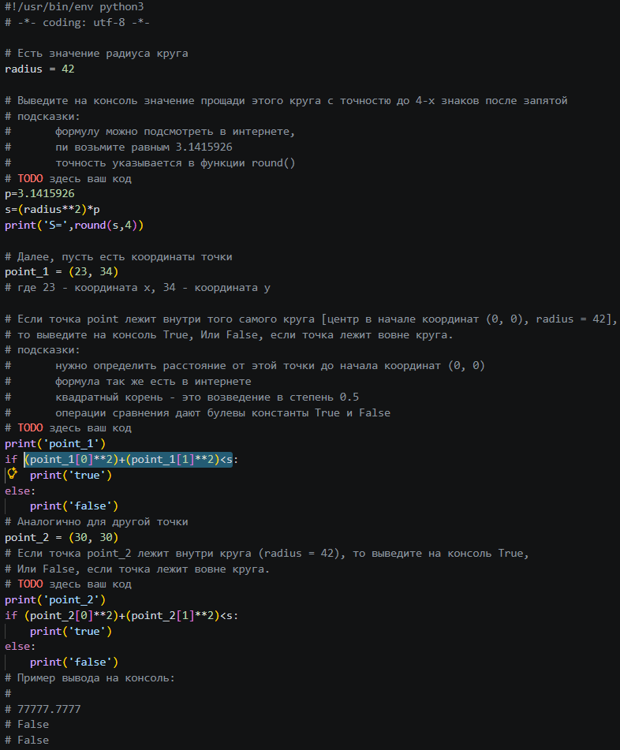
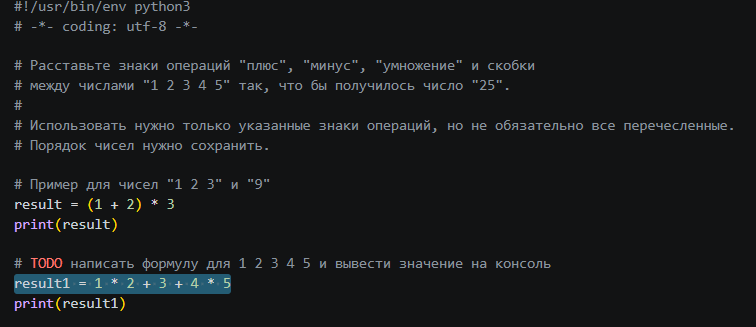
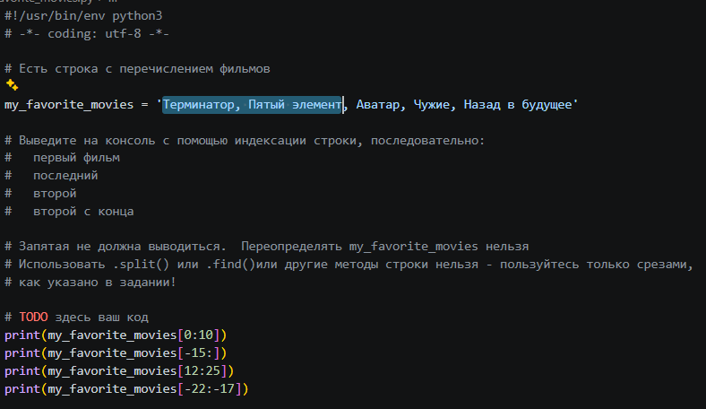
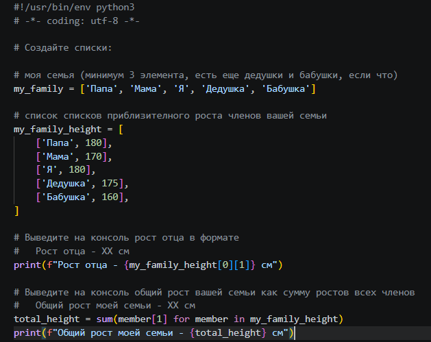
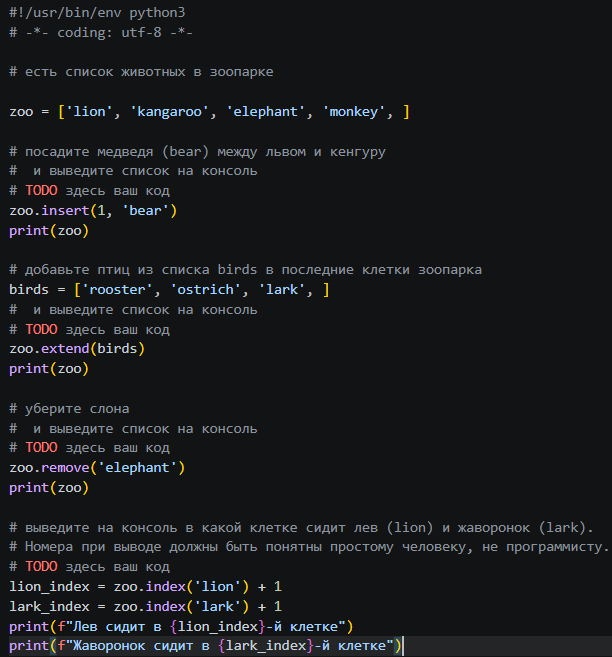
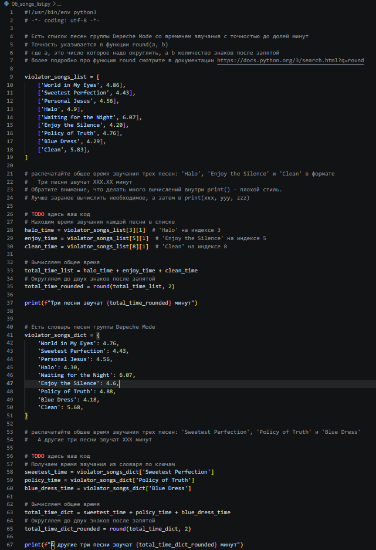
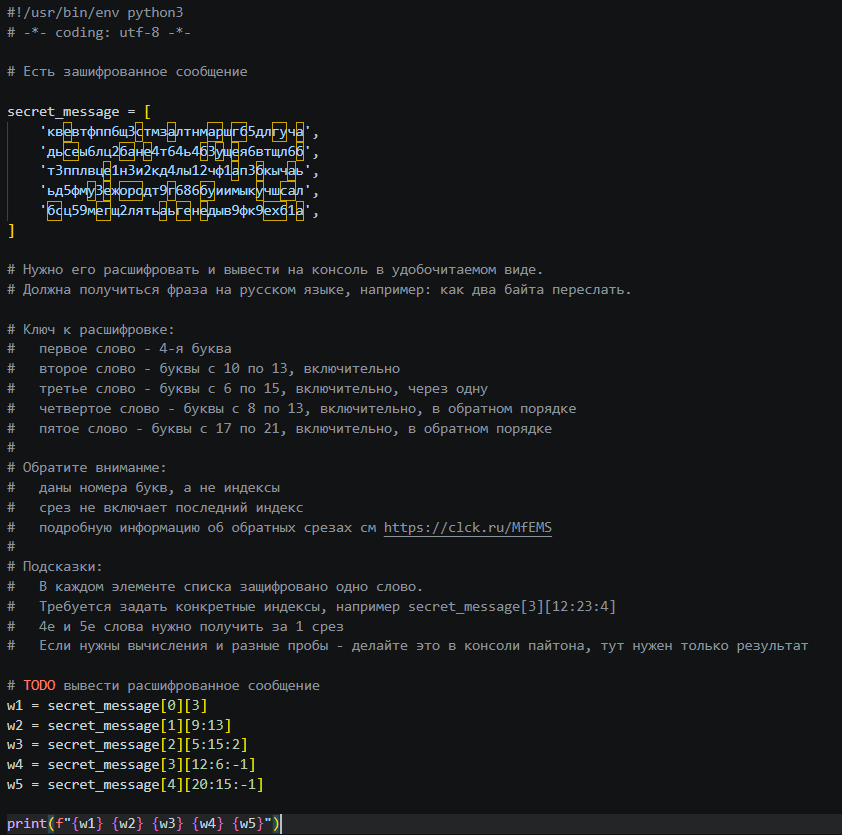
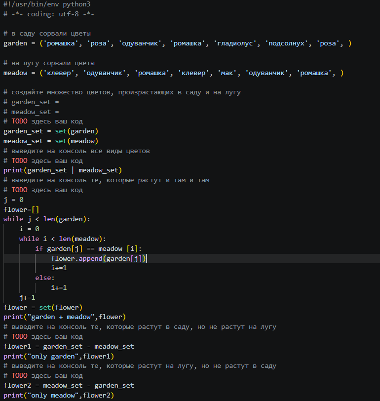
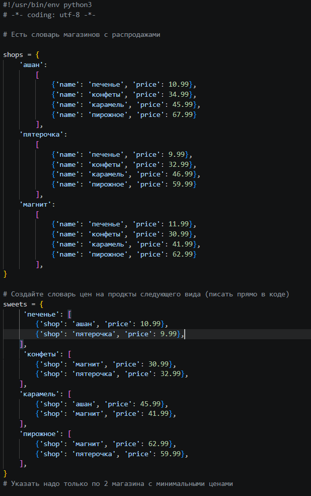
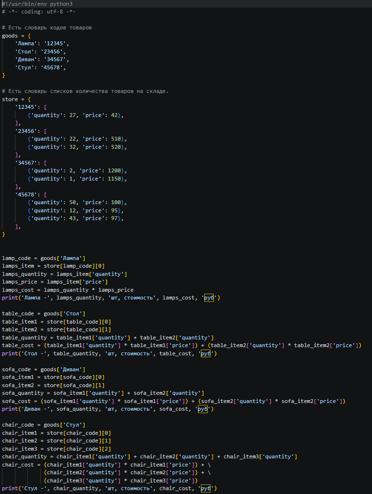

1.Задание:
Нужно написать программу, которая вычисляет площадь круга по заданному радиусу и определяет, попадают ли две указанные точки в этот круг. Все результаты выводятся в консоль с заданной точностью.

Ход выполнения:
1. Рассчитана площадь круга с заданым радиусом и пи равным 3.1415926
2. Написано условие (point_1[0]**2)+(point_1[1]**2)<s , которое проверяет находятся ли первая точка внутри окружности, если условие выполняется выводит "true" если нет то выводится "false"
3. Написано условие (point_2[0]**2)+(point_2[1]**2)<s , которое проверяет находятся ли вторая точка внутри окружности, если условие выполняется выводит "true" если нет то выводится "false"

Результат:

2.Задание:
Расставьте знаки операций "плюс", "минус", "умножение" и скобки
между числами "1 2 3 4 5" так, что бы получилось число "25".

Ход выполнения: 
1. Роздается переменная result1 содержащая числа от 1 до 5 и знаки между ними так что result1 становится равным 25
2. Выводится result1

Результат:

3.Задание:
Выведите на консоль с помощью индексации строки, последовательно: первый фильм, последний, второй, второй с конца

Ход выполнения:
1. Выводит первые 9 символов из строки "my_favorite_movies" 
2. Выводит 15 символов с конца строки "my_favorite_movies" 
3. Выводит с 12 по 24 символы из строки "my_favorite_movies" 
4. Выводит с 22 по 17 символы с конца строки "my_favorite_movies" 

Результат:

4.Задание: 
Создать список членов семьи , вывести рост отца и общий рост семьи 

Ход выполнения: 
1. Создан список членов семьи "my_family"
2. Создан список списков членов семьи "my_family_height"
3. Выводится рост отца из списка "my_family_height"
4. Создается переменая "total_height" равная сумме всех элементов списка "my_family_height" с индексом один 
5. Выводится "total_height"

Результат:

5.Задание:
Дан список zoo. Вставьте bear между lion и kangaroo, добавьте birds в конец, удалите elephant, выведите номера клеток lion и lark

Ход выполнения:
1. Создан список животных zoo с начальными обитателями:['lion', 'kangaroo', 'elephant', 'monkey']
2. Вставлен 'bear' на позицию между львом и кенгуру (индекс 1) — список стал: ['lion', 'bear', 'kangaroo', 'elephant', 'monkey'],выведен обновленный список 
3. Создан список птиц birds с элементами: ['rooster', 'ostrich', 'lark']
4. Добавлены птицы в конец зоопарка методом extend() — список стал: ['lion', 'bear', 'kangaroo', 'elephant', 'monkey', 'rooster', 'ostrich', 'lark'],выведен обновленный список
5. Удален 'elephant' методом remove() — список стал: ['lion', 'bear', 'kangaroo', 'monkey', 'rooster', 'ostrich', 'lark'],выведен обновленный список
6. Найден индекс льва ('lion') — получена позиция 0, прибавлена единица для человеко-понятного формата = 1-я клетка
7. Найден индекс жаворонка ('lark') — получена позиция 6, прибавлена единица = 7-я клетка

Результат:

6.Задание:
Дан список violator_songs_list с названиями песен группы Depeche Mode и их длительностью в минутах. Найди и выведи на экран общее время звучания трёх песен: 'Halo', 'Enjoy the Silence' и 'Clean' в формате "Три песни звучат XXX.XX минут". Также дан словарь violator_songs_dict с теми же песнями, но с другими значениями длительности. Найди и выведи на экран общее время звучания трёх песен: 'Sweetest Perfection', 'Policy of Truth' и 'Blue Dress' в формате "А другие три песни звучат XXX минут"

Ход выполнения:
1. Создан список песен violator_songs_list с 9 песнями и их длительностью
2. Извлечены длительности песен 'Halo' (индекс 3), 'Enjoy the Silence' (индекс 5) и 'Clean' (индекс 8): 4.9, 4.20 и 5.83
3. Вычислена сумма 4.9 + 4.20 + 5.83 = 14.93 и округлена до двух знаков
4. Выведен результат: "Три песни звучат 14.93 минут"
5. Создан словарь violator_songs_dict с 9 песнями и их длительностью
6. Из словаря получены длительности 'Sweetest Perfection' (4.43), 'Policy of Truth' (4.88) и 'Blue Dress' (4.18)
7. Вычислена сумма 4.43 + 4.88 + 4.18 = 13.49 и округлена до двух знаков
8. Выведен результат: "А другие три песни звучат 13.49 минут"

Результат:

7.Задание:
Расшифровать секретное сообщение

Ход выполнения:
1. Взят первый элемент списка secret_message[0] = 'квевтфпп6щ3стмзалтнмаршгб5длгуча', извлечена 4-я буква (индекс 3) - 'в'
2. Взят второй элемент secret_message[1], извлечены буквы с 10 по 13 (индексы 9:13) - 'бане'
3. Взят третий элемент secret_message[2], извлечены буквы с 6 по 15 через одну (индексы 5:15:2) - 'веник'
4. Взят четвёртый элемент secret_message[3], извлечены буквы с 8 по 13 в обратном порядке (индексы 12:6:-1) - 'дороже'
5. Взят пятый элемент secret_message[4], извлечены буквы с 17 по 21 в обратном порядке (индексы 20:15:-1) → 'денег'
6. Слова объединены через пробел и выведены 

Результат:

8.Задание:
Дан кортеж garden с цветами, которые растут в саду, и кортеж meadow с цветами, которые растут на лугу. Нужно создать множества из этих кортежей и выполнить следующие действия: вывести на консоль все виды цветов (объединение множеств), вывести цветы, которые растут и в саду, и на лугу (пересечение множеств), вывести цветы, которые растут только в саду (разность множеств), и вывести цветы, которые растут только на лугу (разность множеств)

Ход выполнения:
1. Создан кортеж garden с цветами сада: ('ромашка', 'роза', 'одуванчик', 'ромашка', 'гладиолус', 'подсолнух', 'роза')
2. Создан кортеж meadow с цветами луга: ('клевер', 'одуванчик', 'ромашка', 'клевер', 'мак', 'одуванчик', 'ромашка')
3. Преобразованы кортежи в множества для удаления дубликатов: garden_set = {'ромашка', 'роза', 'одуванчик', 'гладиолус', 'подсолнух'} и meadow_set = {'клевер', 'одуванчик', 'ромашка', 'мак'}
4. Выведено объединение множеств (все виды цветов): {'ромашка', 'роза', 'одуванчик', 'гладиолус', 'подсолнух', 'клевер', 'мак'}
5. Найдено пересечение множеств (цветы, растущие и там, и там) через циклы: добавлены в список flower совпадающие элементы
6. Преобразован список flower в множество: {'ромашка', 'одуванчик'} и выведен результат
7. Выведена разность множеств (цветы только в саду): garden_set - meadow_set = {'роза', 'гладиолус', 'подсолнух'}
8. Выведена разность множеств (цветы только на лугу): meadow_set - garden_set = {'клевер', 'мак'}

Результат:

9.Задание:
Создайте словарь цен на продкты указав только по 2 магазина с минимальными ценами

Ход выполнения:
1. Создан пустой словарь sweets
2. Вручную добавлен товар 'печенье' со списком из двух магазинов: 'ашан' (10.99) и 'пятерочка' (9.99)
3. Вручную добавлен товар 'конфеты' со списком из двух магазинов: 'магнит' (30.99) и 'пятерочка' (32.99)
4. Вручную добавлен товар 'карамель' со списком из двух магазинов: 'ашан' (45.99) и 'магнит' (41.99)
5. Вручную добавлен товар 'пирожное' со списком из двух магазинов: 'магнит' (62.99) и 'пятерочка' (59.99)
6. Для каждого товара указаны только по 2 магазина с минимальными ценами

Результат:

10.Задание:
Дан словарь goods с названиями товаров и их кодами, а также словарь store, где для каждого кода товара указан список партий с количеством и ценой за штуку. Необходимо для каждого товара (Лампа, Стол, Диван, Стул) вычислить общее количество на складе (суммируя quantity по всем партиям) и общую стоимость (суммируя quantity * price по всем партиям). Результат вывести на консоль в формате: "Название - Х шт, стоимость Y руб".

Ход выполнения:
1. Создан словарь goods с кодами товаров: Лампа=12345, Стол=23456, Диван=34567, Стул=45678
2. Создан словарь store со списками партий товаров по кодам
3. Для Лампы: получен код '12345', взята первая (и единственная) партия: количество 27, цена 42, вычислена стоимость 27×42=1134 руб. Выведено: "Лампа - 27 шт, стоимость 1134 руб"
4. Для Стола: получен код '23456', взяты две партии: 22 шт по 510 руб и 32 шт по 520 руб. Общее количество = 22+32=54 шт. Общая стоимость = (22×510)+(32×520)=11220+16640=27860 руб. Выведено: "Стол - 54 шт, стоимость 27860 руб"
5. Для Дивана: получен код '34567', взяты две партии: 2 шт по 1200 руб и 1 шт по 1150 руб. Общее количество = 2+1=3 шт. Общая стоимость = (2×1200)+(1×1150)=2400+1150=3550 руб. Выведено: "Диван - 3 шт, стоимость 3550 руб"
6. Для Стула: получен код '45678', взяты три партии: 50 шт по 100 руб, 12 шт по 95 руб, 43 шт по 97 руб. Общее количество = 50+12+43=105 шт. Общая стоимость = (50×100)+(12×95)+(43×97)=5000+1140+4171=10311 руб. Выведено: "Стул - 105 шт, стоимость 10311 руб"

Результат:

Источники:
https://doka.guide/tools/markdown/
https://docs.python.org/3/tutorial/