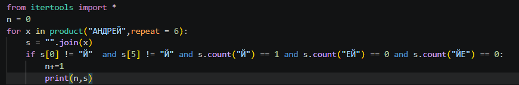
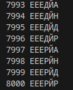
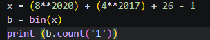
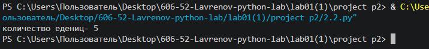
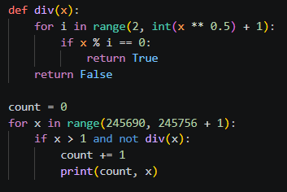
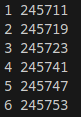

1.Задание:
Посчитать количество слов из строки "АНДРЕЙ" длиной 6 букв с условием что "Й" не стоит в начале слова в его конце и рядом с "Е"

Ход выполнения:
1. Генерируется декартово произведение product("АНДРЕЙ", repeat=6) все возможные строки длины 6 из букв А Н Д Р Е Й
2. Для каждой строки s проверяются ограничения на позиции Й, количество Й, отсутствие сочетаний ЕЙ и ЙЕ
3. Если все условия соблюдены, счётчик n увеличивается на 1 и выводится текущее значение n и сама строка

Результат:

Вывод:

2.Задание:
Посчитать количество едениц в двоичной записи числа равного (8**2020) + (4**2017) + 26 - 1 

Ход выполнения:
1. Создается переменная х равная (8**2020) + (4**2017) + 26 - 1 
2. Создается переменная b равная двоичной записи числа х
3. Выводится количество "1" в b

Результат:

Вывод:

3.Задание:
Найдите среди целых чисел на отрезке [245690; 245756] простые числа

Ход выполнения:
1. Создается функция div(x), которая возвращает True, если у числа x есть делитель от 2 до корня x
2. Запускается цикл for x in range(245690, 245756 + 1)
3. Для каждого x проверяется: x > 1 and not div(x)
4. Если условие истинно то count += 1 и выводится count, x

Результат:

Вывод:

Источники:
https://habr.com/ru/companies/otus/articles/529356/
https://docs.python.org/3/library/itertools.html
https://proglib.io/p/iteriruemsya-pravilno-20-priemov-ispolzovaniya-v-python-modulya-itertools-2020-01-03
