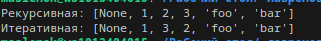
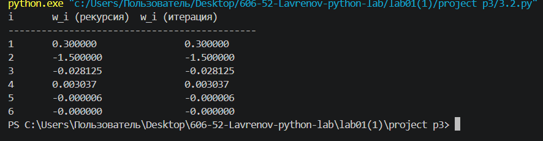

1.Задание:
Написать две функции первая с рекурсией вторая без рекурсии для распаковки списка, содержащего другие объекты (int, str, list, tuple, dict, set)

Ход выполнения:
1. Определена рекурсивная функция unpack_recursive, которая принимает на вход вложенную структуру данных (список, кортеж, множество, словарь) и рекурсивно обходит все элементы, извлекая атомарные значения (не являющиеся контейнерами).
2. Реализована внутренняя функция extract, которая проверяет тип текущего элемента: для списков и кортежей она перебирает каждый подэлемент и вызывает extract рекурсивно, обеспечивая полный обход вложенности.
3. Добавлена обработка множеств (set) — аналогично спискам, все элементы множества передаются в рекурсивный вызов extract, так как множество является итерируемым контейнером.
4. Реализована обработка словарей (dict) — для каждой пары ключ-значение рекурсивно извлекаются и ключ, и значение, что позволяет сохранить порядок их появления в плоском списке.
5. Базовый случай рекурсии — если элемент не является ни одним из известных контейнеров (число, строка, None и т.д.), он добавляется в список result, который затем возвращается.
6. Разработана итеративная функция unpack_iterative, использующая стек вместо рекурсии для обхода тех же типов данных, чтобы избежать возможного переполнения стека при очень глубокой вложенности.
7. В итеративной версии организован обход в обратном порядке (reversed(current) для списков и кортежей, а также [::-1] для элементов словаря), чтобы сохранить исходную последовательность элементов при помещении их в стек и последующем извлечении.
8. Выполнена проверка на тестовых данных — [None, [1, ({2, 3}, {'foo': 'bar'})]]; обе функции успешно извлекли все атомарные элементы: None, 1, 2, 3, 'foo', 'bar', причём итеративная версия сохранила тот же порядок, что и рекурсивная.

Результат:

2.Задание:
написать две функции первая с рекурсией вторая без рекурсии для расчёта

Ход выполнения:

1. Определена рекурсивная функция w_recursive(i) для вычисления последовательности, где каждый элемент зависит от двух предыдущих по формуле: w_i = w_(i-1) * w_(i-2) * ((i-1)² / (i+1)³).
2. Заданы базовые случаи рекурсии — для i = 1 функция возвращает 0.3, для i = 2 возвращает -1.5, что позволяет прекратить рекурсивные вызовы и начать обратный ход вычислений.
3. Реализован рекурсивный шаг — для i > 2 функция вызывает саму себя дважды: для вычисления w_recursive(i-1) и w_recursive(i-2), затем перемножает их с коэффициентом ((i-1)² / (i+1)³), строго следуя математической формуле.
4. Определена итеративная функция w_iterative(i) с теми же базовыми случаями, но вместо рекурсии используется цикл, что позволяет избежать многократных повторных вычислений одних и тех же значений.
5. Выполнена инициализация переменных — w_prev2 = 0.3 (соответствует w_(i-2)) и w_prev1 = -1.5 (соответствует w_(i-1)), которые будут сдвигаться на каждой итерации цикла.
6. Реализован циклический расчёт — для значений current_i от 3 до заданного i вычисляется текущий член последовательности по той же формуле, затем выполняется сдвиг переменных: w_prev2, w_prev1 = w_prev1, w_current для подготовки к следующей итерации.
7. Организован вывод результатов — для значений i от 1 до 6 одновременно вызываются обе функции, их результаты выводятся в виде таблицы с тремя колонками: номер индекса, значение рекурсивной функции, значение итеративной функции.
8. Проведена валидация — оба метода дают одинаковые результаты для всех проверяемых i, что подтверждает корректность реализации как рекурсивного, так и итеративного подходов, при этом итеративная версия работает значительно быстрее при больших i за счёт исключения повторных вызовов.

Результат:

3.Задание:
