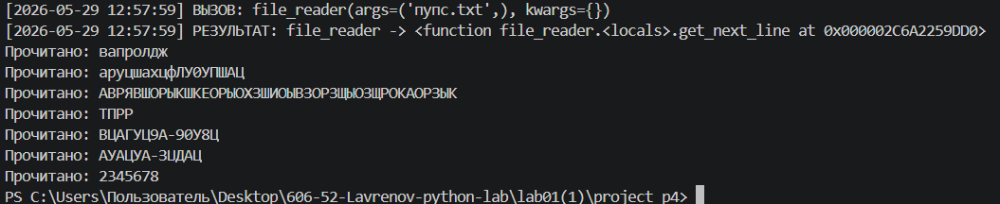

Задание:
написать Замыкание для получения очередной строки из файла.
Декоратор, который будет логировать вызовы функций.

Ход выполнение:
1. Импорт необходимых модулей
Импортируется модуль functools для использования декоратора @wraps (сохраняет метаданные исходной функции)
Импортируется класс datetime из модуля datetime для получения временных меток

2. Создание декоратора logger_decorator
Определяется функция logger_decorator(func), которая принимает другую функцию в качестве аргумента
Внутри неё определяется функция-обёртка wrapper(*args, **kwargs):
*args - принимает любое количество позиционных аргументов
**kwargs - принимает любое количество именованных аргументов

3. Логирование вызова функции
Создаётся временная метка timestamp в формате "Год-месяц-день Часы:Минуты:Секунды"
Получается имя вызываемой функции через func.__name__
Выводится сообщение в консоль: [время] ВЫЗОВ: имя_функции(args=аргументы, kwargs=именованные_аргументы)

4. Выполнение и логирование результата
Вызывается исходная функция: result = func(*args, **kwargs)
Выводится сообщение с результатом: [время] РЕЗУЛЬТАТ: имя_функции -> результат
Функция-обёртка возвращает результат выполнения исходной функции

5. Применение декоратора к функции file_reader
Строка @logger_decorator применяет декоратор к функции file_reader
Теперь при каждом вызове file_reader() автоматически выполняется логирование

6. Создание функции file_reader(file_path)
Функция принимает один аргумент - file_path (путь к файлу)
Открывается файл по указанному пути в режиме чтения ('r') с кодировкой utf-8

Все строки файла считываются методом readlines() и сохраняются в переменную lines

7. Создание замыкания (closure)
Внутри функции file_reader создаётся переменная index = -1 (будет хранить текущую позицию чтения)
Определяется внутренняя функция get_next_line():
Используется ключевое слово nonlocal index для доступа к переменной внешней функции
При каждом вызове index увеличивается на 1
Если index не превышает длину списка lines, возвращается очередная строка без символа переноса строки (rstrip('\n'))
Если строки закончились, возвращается None

8. Возврат замыкания
Функция file_reader возвращает внутреннюю функцию get_next_line (но не вызывает её!)
В переменную w сохраняется это замыкание - функция, которая "запомнила" внутри себя список строк и текущий индекс

9. Использование замыкания для чтения файла
Вызывается w = file_reader('пупс.txt') - создаётся замыкание для конкретного файла
Вызывается line = w() - получается первая строка файла
Запускается цикл while line is not None:
Выводится сообщение "Прочитано: {line}"
Вызывается line = w() для получения следующей строки
Цикл продолжается, пока w() возвращает строки (не None)

вывод: