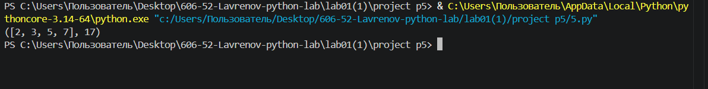

Задание:
Написать генератор простых чисел просуммировать возращенные числа 

Ход выполнения:
1. Определяется функция-генератор prost(limit), внутри которой создаётся пустой список a и запускается цикл for num in range(2, limit + 1) для перебора всех чисел от 2 до заданной границы.
2. Для каждого числа num создается диапазон возможных делителей от 2 до int(num ** 0.5) + 1, и с помощью filter(lambda p: num % p == 0, i) отбираются все делители, на которые num делится без остатка.
3. Если полученный список делителей p оказывается пустым (len(p) == 0), это означает, что число num является простым, и оно добавляется в список a.
4. С помощью reduce(lambda x, y: x + y, a) вычисляется сумма всех простых чисел, накопленных в списке a на данный момент, и генератор возвращает (yield) пару значений: сам список a и его сумму s.
5. Создаётся переменная limit = 10, затем в цикле for x in prost(limit) происходит вызов генератора, и на каждом шаге на экран выводится очередной кортеж (a, s) (только для простых чисел).

Вывод:

Источник:https://learnpython.org/ru/Map,%20Filter,%20Reduce
