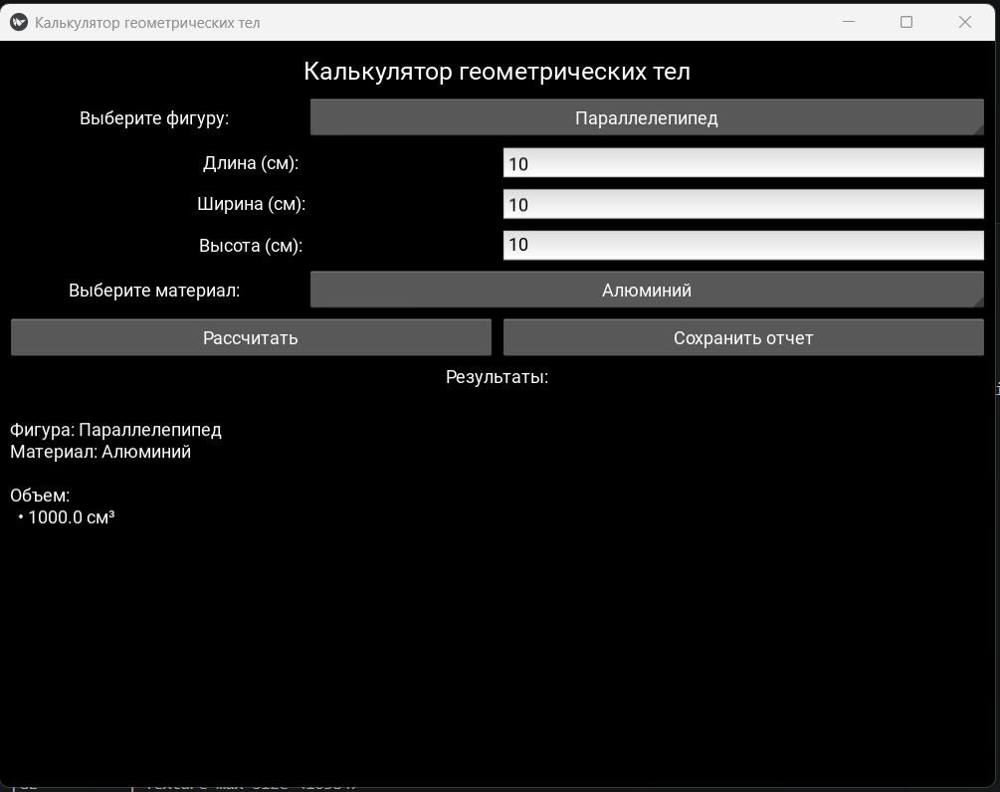

Задача:
Расчёт объема, площади поверхности, массы в зависимости от материала.

Ход выполнения:
1. Инициализация приложения и настройка окна: Установлен размер окна 800x600 пикселей через Window.size = (800, 600). Создан главный класс GeometryApp, наследующий от App Kivy.
2. Построение пользовательского интерфейса: В методе build() создана вертикальная компоновка BoxLayout с отступами. Добавлены основные элементы интерфейса: заголовок, выпадающий список для выбора фигуры, динамическая сетка ввода параметров, выпадающий список для выбора материала, кнопки "Рассчитать" и "Сохранить отчет", а также область прокрутки для вывода результатов.
3. Реализация динамического обновления полей ввода: Создан метод update_input_fields(), который очищает сетку ввода и на основе выбранной фигуры (из shape_spinner) добавляет соответствующие поля: три поля для параллелепипеда (длина, ширина, высота), одно поле для тетраэдра (ребро) и одно для шара (радиус). Каждому полю присваивается атрибут для последующего доступа.
4. Обработка смены фигуры: Реализован метод on_shape_change(), который при изменении выбранной фигуры обновляет current_shape, вызывает обновление полей ввода, очищает результаты и блокирует кнопку сохранения отчета.
5. Сбор введенных размеров: Создан метод get_dimensions(), который на основе current_shape извлекает значения из соответствующих полей ввода и преобразует их в числа с плавающей точкой. Для параллелепипеда собираются три измерения, для тетраэдра и шара — по одному.
6. Реализация расчета: В методе calculate() выполняется:
Получение размеров через get_dimensions() Проверка на положительные значения (все размеры должны быть > 0) Маппинг русских названий фигур на английские для передачи в модуль расчетов
Вызов функции calculate_shape() из модуля geometry_app.calculations с передачей типа фигуры, размеров и названия материала Сохранение результата в self.last_result Отображение результатов и активация кнопки сохранения
7. Отображение результатов: В методе display_result() результаты форматируются в многострочную строку с отображением объема (см³ и м³), площади поверхности (см² и м²) и массы (г и кг) в удобочитаемом виде.
8. Сохранение отчета: Реализован метод save_report(), который: Создает директорию reports при необходимости
Генерирует имя файла с временной меткой (report_YYYYMMDD_HHMMSS.txt)
Записывает в файл подробный отчет с датой, параметрами фигуры, материалом и всеми рассчитанными значениями
Выводит всплывающее окно об успешном сохранении
9. Обработка ошибок и уведомления: Созданы вспомогательные методы show_error() и show_info() для отображения всплывающих окон Popup при возникновении ошибок (отрицательные/нулевые размеры, исключения при расчете) или успешных операциях.
10. Обработка событий: Кнопка "Рассчитать" привязана к методу calculate через on_press, кнопка "Сохранить отчет" — к save_report. Изначально кнопка сохранения отключена и активируется только после успешного расчета.
11. Запуск приложения: В блоке if __name__ == '__main__' создается экземпляр класса GeometryApp и вызывается метод run(), который запускает главный цикл обработки событий графического интерфейса.

Результат: