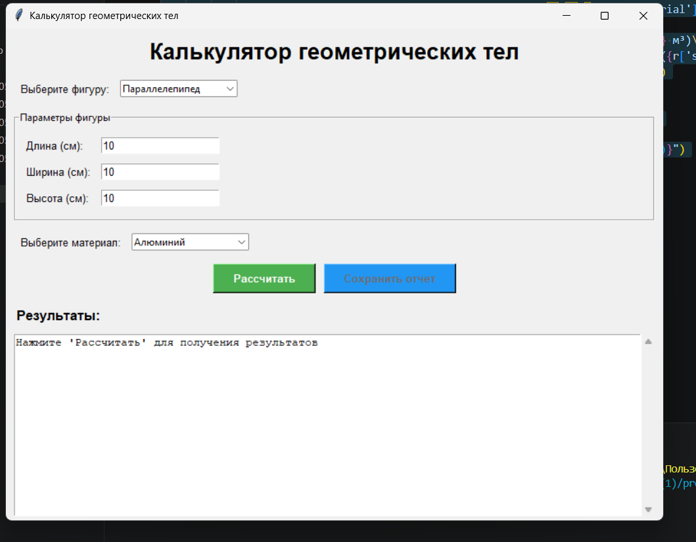

Задача:
Расчёт объема, площади поверхности, массы в зависимости от материала.

Ход выполнения:
1. Импорт необходимых модулей
Импортируется tkinter и его компоненты: ttk (тематические виджеты), messagebox (диалоговые окна), scrolledtext (текстовое поле с прокруткой)
Импортируется ABC и abstractmethod из модуля abc для создания абстрактного базового класса
Импортируется datetime для формирования временных меток в отчетах
Импортируется typing.Dict, Any, Optional для аннотации типов
Импортируется os для работы с файловой системой
Импортируются пользовательские модули: calculate_shape из geometry_app.calculations (функция расчета) и get_material_names из geometry_app.materials (список материалов)

2. Создание абстрактного базового класса Shape
Класс наследуется от ABC (делает класс абстрактным)
В конструкторе __init__(self, name: str) инициализируются защищенные атрибуты: _name, _dimensions, _material
Создаются managed attributes (свойства) с декораторами @property и @setter:
name - при установке проверяет, что значение не пустое и является строкой
dimensions - геттер возвращает копию словаря (защита от изменения), сеттер проверяет, что размеры не пустые и все значения положительные
material - сеттер проверяет, что значение строка (если указано)
Определяются абстрактные методы (декоратор @abstractmethod):
get_shape_type() - возвращает тип фигуры в виде строки
get_input_fields() - возвращает список полей ввода для конкретной фигуры
Определяются Dunder-методы:
__str__() - строковое представление фигуры (название и материал)
__eq__(self, other) - сравнение фигур по названию и размерам
__repr__(self) - формальное представление для отладки

3. Создание класса Parallelepiped (наследник Shape)
В конструкторе __init__() вызывается super().__init__("Параллелепипед") и создаются приватные атрибуты: _length, _width, _height
Создаются свойства с валидацией (каждое значение должно быть положительным)
Реализуется абстрактный метод get_shape_type(): возвращает "parallelepiped"
Реализуется абстрактный метод get_input_fields(): возвращает список кортежей (метка, имя атрибута) - три поля: длина, ширина, высота
Переопределяются Dunder-методы __str__() (добавляет размеры) и __repr__()

4. Создание класса Tetrahedron (наследник Shape)
В конструкторе вызывается super().__init__("Тетраэдр") и создается _edge (ребро)
Свойство edge с проверкой на положительность
get_shape_type() возвращает "tetrahedron"
get_input_fields() возвращает одно поле: длина ребра
Переопределены __str__() и __repr__()

5. Создание класса Sphere (наследник Shape)
В конструкторе вызывается super().__init__("Шар") и создается _radius
Свойство radius с проверкой на положительность
get_shape_type() возвращает "sphere"
get_input_fields() возвращает одно поле: радиус
Переопределены __str__() и __repr__()

6. Создание класса ShapeFactory (Фабрика)
Статический метод create_shape(shape_name: str) -> Shape:
Создается словарь shapes, где ключ - название фигуры, значение - класс
По названию фигуры извлекается соответствующий класс
Если класс не найден, выбрасывается исключение ValueError
Возвращается созданный экземпляр фигуры
Определены __str__() и __repr__() для информативности

7. Создание главного класса GeometryApp
В конструкторе __init__(self, root) сохраняется ссылка на корневое окно
Настраивается окно: заголовок "Калькулятор геометрических тел", размер 800×600, возможность изменения размера
Инициализируются атрибуты: current_shape, last_result, input_fields (пустой словарь)
Вызывается метод init_ui() для создания интерфейса

8. Инициализация пользовательского интерфейса (метод init_ui)
Заголовок: tk.Label с текстом и шрифтом Arial 20 жирный
Фрейм выбора фигуры:
Выпадающий список (ttk.Combobox) с тремя значениями
Привязка события <<ComboboxSelected>> к методу on_shape_change
Фрейм полей ввода (LabelFrame с заголовком "Параметры фигуры")
Фрейм выбора материала:
Выпадающий список с материалами из get_material_names()
Фрейм кнопок:
Кнопка "Рассчитать" (зеленая) с вызовом calculate()
Кнопка "Сохранить отчет" (синяя) с вызовом save_report(), изначально неактивна
Область результатов:
Заголовок "Результаты:"
Поле scrolledtext.ScrolledText (с прокруткой) для вывода
Изначально выводится подсказка, поле в режиме только для чтения
Вызывается update_input_fields("Параллелепипед") для создания полей ввода по умолчанию

9. Обработчик изменения фигуры (on_shape_change)
Получает название выбранной фигуры из self.shape_var.get()
Вызывает update_input_fields(shape_name) для обновления полей ввода
Очищает область результатов, выводит подсказку
Блокирует кнопку сохранения отчета
Сбрасывает last_result = None

10. Обновление полей ввода (update_input_fields)
Удаляет все дочерние виджеты из self.input_frame
Очищает словарь self.input_fields
Создает новую фигуру через ShapeFactory.create_shape(shape_name)
Получает список полей ввода через self.current_shape.get_input_fields()
В цикле для каждого поля:
Создает метку (tk.Label) с текстом
Создает поле ввода (tk.Entry) со значением по умолчанию "10"
Сохраняет поле в словарь self.input_fields[attr_name] = entry

11. Получение размеров из полей ввода (get_dimensions)
Создается пустой словарь dimensions
В цикле по self.input_fields.items():
Пытается преобразовать значение поля в float()
Проверяет, что значение > 0
В случае ошибки выбрасывает ValueError с понятным сообщением
Возвращает словарь с размерами

12. Расчет параметров фигуры (calculate)
В блоке try:
Получает размеры через get_dimensions()
Получает выбранный материал из self.material_var.get()
В зависимости от типа фигуры устанавливает соответствующие атрибуты через свойства (срабатывает валидация)
Устанавливает материал фигуры
Вызывает функцию calculate_shape() с параметрами: тип фигуры, размеры, материал
Сохраняет результат в self.last_result
Вызывает display_result() для отображения
Активирует кнопку сохранения отчета
В блоках except обрабатываются ошибки ввода и прочие исключения с выводом messagebox

13. Отображение результатов (display_result)
Проверяет наличие self.last_result
Формирует многострочную строку с результатами:
Название фигуры и материал
Объем в см³ и м³
Площадь поверхности в см² и м²
Масса в граммах и килограммах
Разблокирует текстовое поле (state=tk.NORMAL)
Очищает и вставляет новую строку
Снова блокирует поле (state=tk.DISABLED) для предотвращения редактирования

14. Сохранение отчета (save_report)
Проверяет наличие результатов, иначе выводит предупреждение
Создает директорию reports (если не существует) через os.makedirs("reports", exist_ok=True)
Формирует имя файла: report_ГГГГММДД_ЧЧММСС.txt

В блоке try открывает файл на запись в кодировке UTF-8
Записывает в файл:
Заголовок отчета
Дату и время
Название фигуры и материал
Результаты расчетов (объем, площадь, масса)
Выводит сообщение об успехе с указанием пути к файлу
В случае ошибки выводит сообщение через messagebox

15. Dunder-методы класса GeometryApp
__str__() возвращает строку с заголовком окна
__repr__() возвращает строку с размером окна

16. Запуск приложения
Блок if __name__ == '__main__': (выполняется только при прямом запуске)
Создается корневое окно tk.Tk()
Создается экземпляр приложения GeometryApp(root)
Запускается главный цикл root.mainloop() (ожидание событий)

вывод: