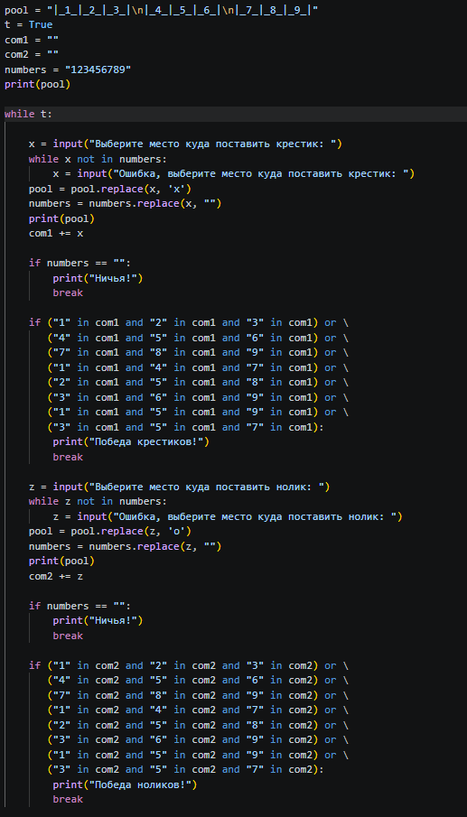
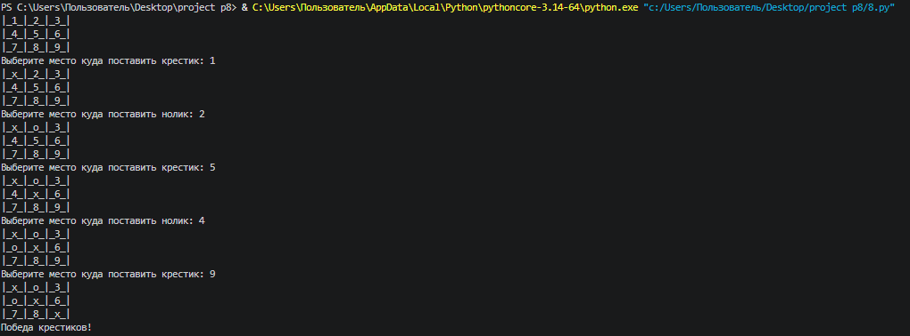

Задание:
Написать игру крестики нолики

Ход выполнения:
1. Инициализируются переменные: pool с игровым полем, t = True, com1 = "", com2 = "", numbers = "123456789". Выводится пустое поле.
2. Программа входит в цикл while t и запрашивает у пользователя ввод x (место для крестика), проверяя его наличие в numbers до корректного ввода.
3. Поле обновляется: pool.replace(x, 'x'), цифра удаляется из numbers, выводится обновлённое поле, ход добавляется в com1.
4. Проверяется ничья: если numbers == "", выводится "Ничья!" и выполняется break.
5. Проверяется победа крестиков: если любая из 8 комбинаций собрана в com1, выводится "Победа крестиков!" и выполняется break.
6. Запрашивается ввод z (место для нолика), проверяется его наличие в numbers до корректного ввода.
7. Поле обновляется: pool.replace(z, 'o'), цифра удаляется из numbers, выводится обновлённое поле, ход добавляется в com2.
8. Проверяется ничья: если numbers == "", выводится "Ничья!" и выполняется break.
9. Проверяется победа ноликов: если любая из 8 комбинаций собрана в com2, выводится "Победа ноликов!" и выполняется break.
10. Если игра не завершена, цикл while t переходит к следующей итерации (пункт 2), и ход переходит к крестикам

Результат:

Вывод: